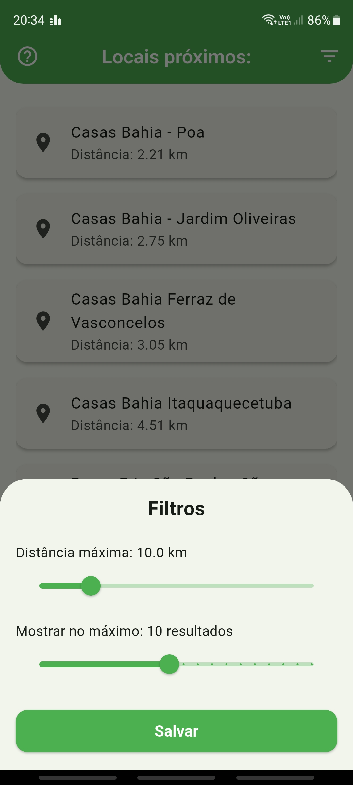
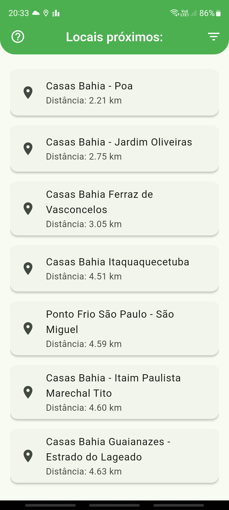
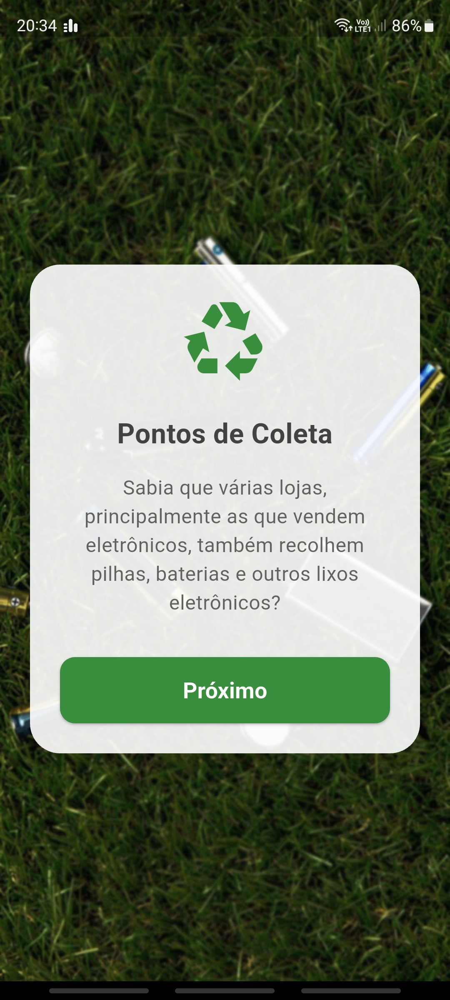

# LixoOn

O **LixoOn** é um aplicativo que ajuda usuários a encontrarem pontos de descarte consciente de lixo próximo à sua localização atual. Ele utiliza geolocalização para listar locais com base em distância máxima configurável e apresenta as opções em uma interface simples e eficiente.

## 📱 Funcionalidades

- Busca automática de locais de descarte por proximidade.
- Filtros configuráveis de distância e quantidade de resultados.
- Redirecionamento para o Google Maps para navegação até o ponto selecionado.

## 🧭 Proposta

Promover o descarte responsável e sustentável de resíduos eletrônicos e baterias ao conectar cidadãos a pontos de coleta próximos.

---

## 📸 Capturas de Tela

  
  
  

---